## 📷 Screenshots

### 🏠 Trang chủ
Giao diện trang chủ hiển thị danh sách sản phẩm nổi bật, hỗ trợ người dùng duyệt và tìm kiếm sản phẩm nhanh chóng.
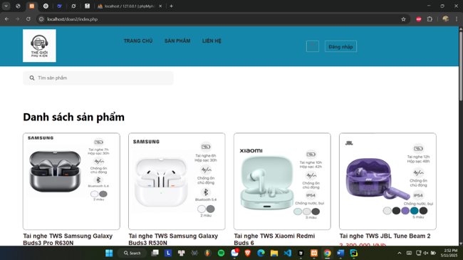

### 📋 Danh mục sản phẩm
Trang danh mục cho phép phân loại và hiển thị sản phẩm theo từng nhóm, giúp người dùng dễ dàng lựa chọn.
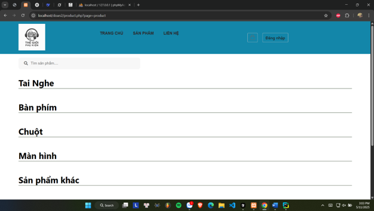

### 📄 Chi tiết sản phẩm
Hiển thị đầy đủ thông tin sản phẩm, hình ảnh, giá bán và chức năng thêm vào giỏ hàng.
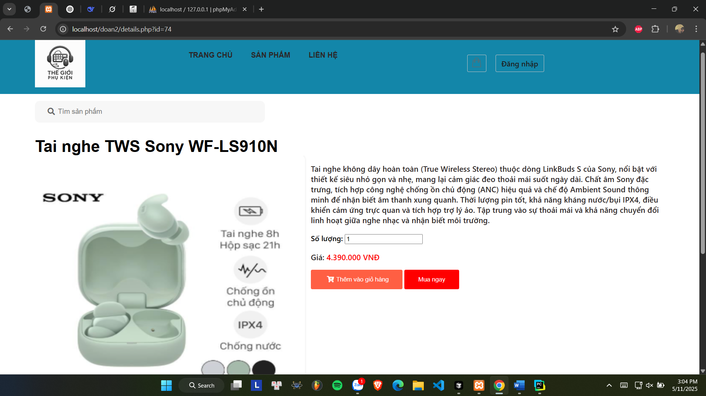

### 🛒 Đặt hàng & Thanh toán
Quy trình đặt hàng và thanh toán được thiết kế đơn giản, hỗ trợ người dùng hoàn tất đơn mua thuận tiện.
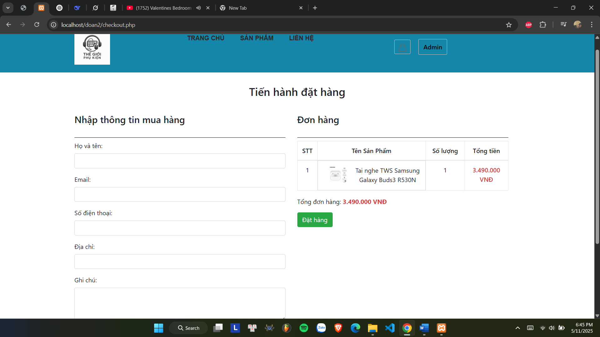
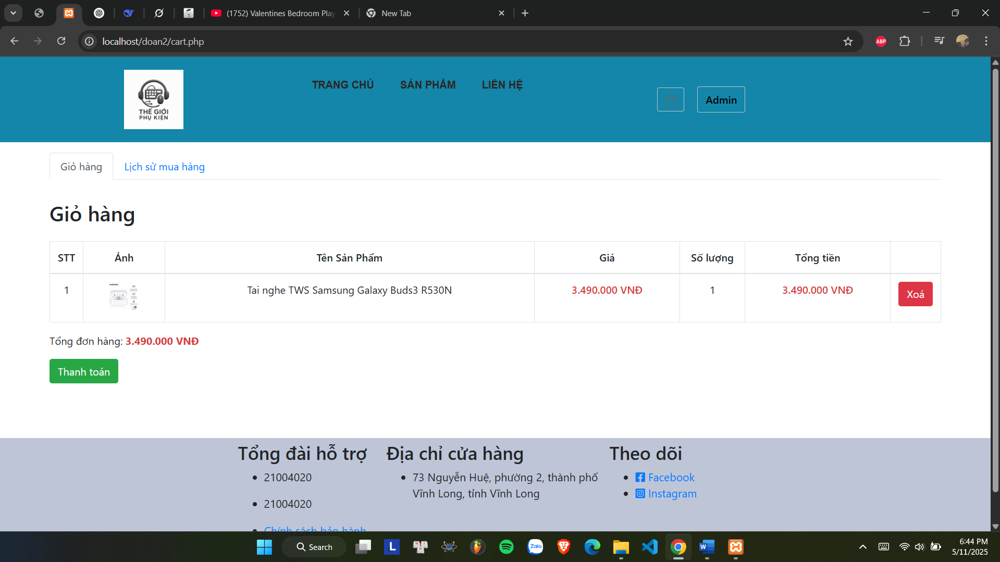

### 👤 Đăng ký / Đăng nhập
Chức năng đăng ký và đăng nhập tài khoản, phục vụ quản lý thông tin người dùng và xác thực truy cập.
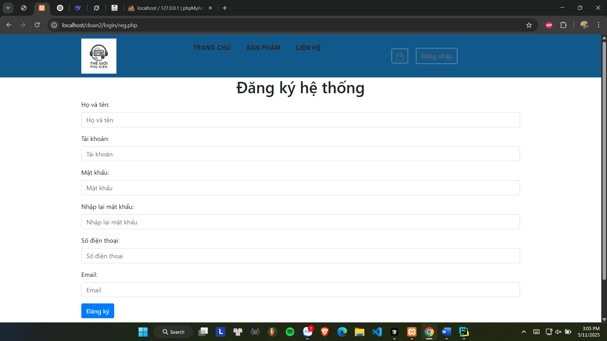
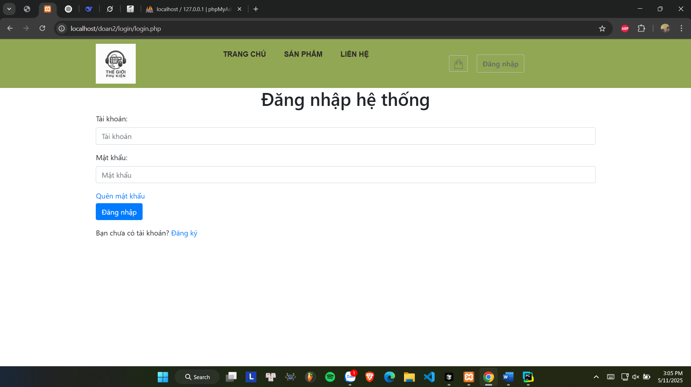

### 🔐 Quên mật khẩu
Chức năng hỗ trợ người dùng khôi phục mật khẩu khi quên thông tin đăng nhập.
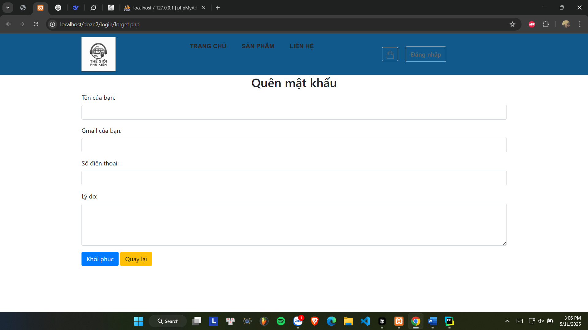

### ⚙️ Quản trị viên (Admin)
Giao diện quản trị cho phép quản lý danh mục, sản phẩm và theo dõi thống kê hoạt động bán hàng.
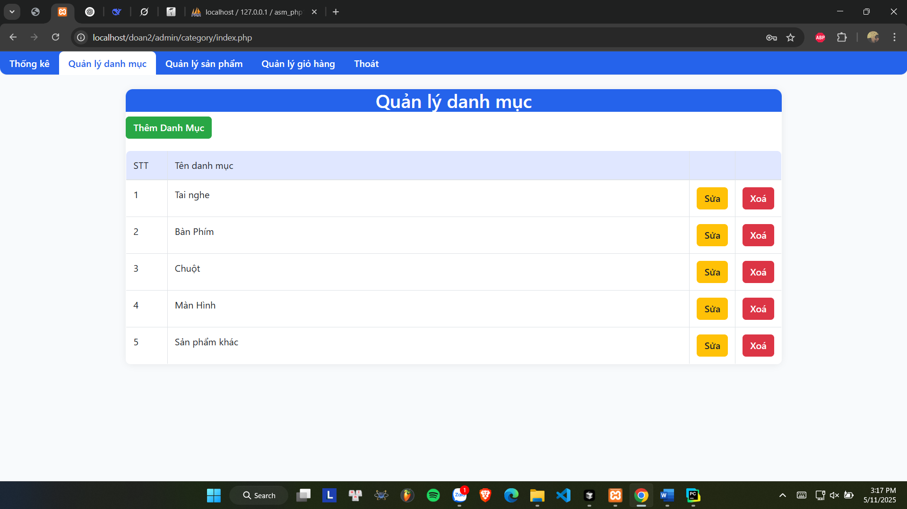
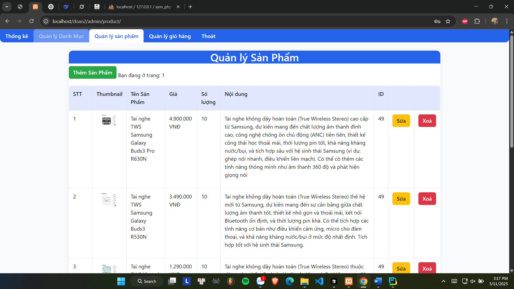
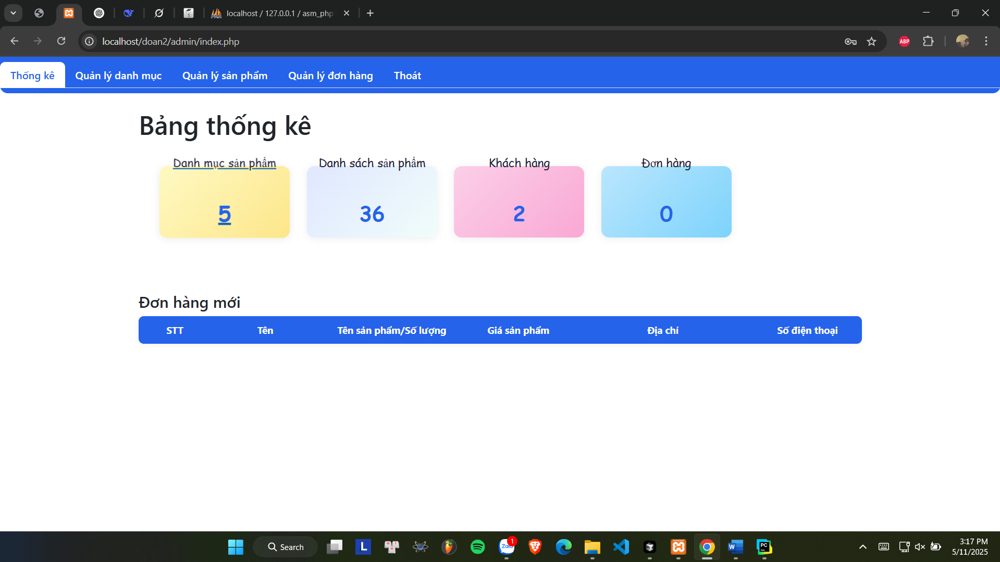
